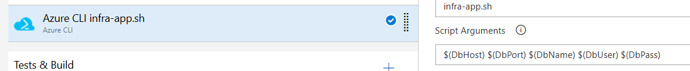
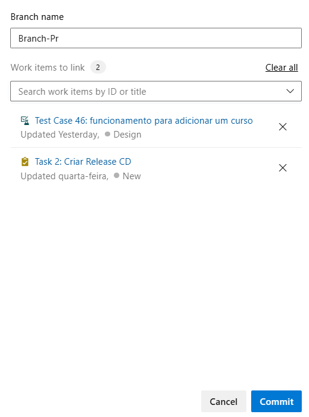

# SkillBridge-Devops

 17.49.10_0550f589.jpg>)

### Solução da matéria de Devops, com implementações de Pipelines CI/CD no Azure.

## A solução desenvolvida consiste em uma aplicação ASP.NET Core hospedada em ambiente Azure, com integração contínua e entrega contínua (CI/CD) automatizadas por meio do Azure DevOps. 
 O sistema permite o gerenciamento de funcionalidades versionadas e rastreáveis dentro de um fluxo ágil, onde cada commit e pull request é vinculado a tasks criadas no **Azure Boards**, garantindo rastreabilidade e controle de mudanças. 

Ao submeter um pull request, o processo de integração contínua (CI) é **automaticamente acionado via triggers**, realizando o build da aplicação, a execução de testes automatizados e a criação dos recursos necessários no Azure, como o App Service, grupo de recursos e tabelas de banco de dados. 

Além disso, foi desenvolvido um script .sh executado via Git Bash, responsável por provisionar um banco de dados MySQL em nuvem. Esse script cria o grupo de recursos, **realiza o build da imagem oficial do MySQL**, publica a imagem no Azure Container Registry (ACR) e instancia o banco de dados para uso na aplicação. Lembrando que nosso app service para criar uma infra inicial utilizando na pipeline de CI, também está presente no Repos como um .sh, porém ele é executado dentro da pipeline de forma automática, sendo reponsável por conectar ao banco de dados e subir as tabelas também. 

**Após o sucesso da pipeline de build, uma pipeline de entrega contínua (CD) é acionada automaticamente, utilizando o artefato gerado para implantar a versão mais recente da aplicação no ambiente de nuvem.**

## Stack de Tecnologias Utilizadas 
```bash
    Linguagem e Framework: .NET 9 / ASP.NET Core **(no app service adicionado RUNTIME="DOTNET|8.0")**

    Banco de Dados: MySQL (hospedado em contêiner no Azure) 

    Controle de Versão: Azure Repos (Git) 

    Orquestração CI/CD: Azure DevOps Pipelines 

    Gerenciamento de Tarefas: Azure Boards 

    Infraestrutura e Deploy: Azure App Service, Azure Resource Group, Azure Container Registry (ACR) 

    Automação de Infraestrutura: Shell Script (.sh) + Git Bash + Azure CLI 
```

## Ideia do projeto:
### SkillBridge — Plataforma de requalificação e conexão trabalho×aprendizado

Resumo: um sistema que ajuda pessoas a se requalificarem (cursos curtos + micro-tarefas), conecta perfis a vagas/mentorias e gera um learning path personalizado via IA. O sistema tem:

- API principal (CRUD) para usuários, perfis, competências, cursos, vagas, matrículas.

- Serviço Java/Spring para orquestração, validações, mensageria e integração com IA.

- Serviço de IA (integração simples com API generativa — ex: HuggingFace/OpenAI — ou ML.NET para scoring) para gerar recomendações de cursos e calcular compatibilidade candidato↔vaga.

- Frontend mobile (React Native) com 6 telas (Login, Home, Catalogo de Cursos, Vagas, Perfil, Detalhes/Inscrição).

- Banco relacional (Oracle) com procedures + export JSON → import MongoDB para consultas rápidas/IA.

- Infra/CI: Azure DevOps + Azure (scripts Azure CLI), pipelines (build + release) e deploy nuvem da aplicação .NET.

**Por que encaixa no tema “Futuro do Trabalho”? conecta requalificação, IA como parceira e inclusão — tudo pedido pelo desafio.**

# Como Utilizar?

Dentro da nossa Organização no Azure Devops utilizamos o Boards, o qual integrado com a matéria de Quality Assurance, justamente para criar nossas Taks de maneira organizada e assertiva:


**Associamos a um PR e commits os nossos Work Items o que esta prescrito em nossa Arquitetura.**



--


**Após realizarmos o nosso commit em outra branch sem ser a MAIN (regra da main ser a branch principal), solicitamos o PR e adicionamos um revisor padrão para aprová-lo**



--


--


--

### Revisor Padrão


**Logo após o merge aprovado rodará as Pipelines de CI e CD de maneira automática pelos triggers**

# Banco de dados:

Deve-se rodar o banco antes de tudo via GitBash e subir na nuvem via azure

## O que contém no arquivo "infra-banco.sh"?
**Este arquivo é um script bash automatizado que cria toda a infraestrutura necessária para rodar um banco MySQL na Azure, utilizando Azure Container Instances (ACI) e Azure Container Registry (ACR).**

Ele executa tudo de ponta a ponta, sem precisar configurar nada manualmente no portal.

Principais etapas do script

#### Configura variáveis principais
- Define nome do banco, resource group, região, senha, imagem, etc.

- Gera um nome único para o ACR
- Evita conflitos usando um sufixo aleatório.

- Garante que o usuário está logado no Azure
- Executa az login se necessário.

- Cria o Resource Group
- Agrupa todos os recursos do banco.

- Cria o Azure Container Registry (ACR)
- Onde ficará armazenada a imagem Docker do MySQL.

- Habilita credenciais admin do ACR
- Necessário para o ACI puxar a imagem.

- Importa a imagem MySQL 8.0 do Docker Hub para o ACR
- Garante que a imagem está no repositório privado.

- Remove container de banco antigo (se existir)
- Evita conflitos quando redeploy.

- Cria um container MySQL dentro do ACI
Com:
```bash
    CPU e memória configuradas
    IP público
    Porta 3306 liberada
    Variáveis de ambiente (senha root, DB inicial)
    Restart automático
    Aguarda o MySQL inicializar
```
```bash
    Exibe no final:
    IP público do banco
    Porta
    Comando para ler logs do MySQL
```
#### Por que usar este script (e por que colocá-lo no README)

Este script existe para:

✔ Automatizar o deploy do MySQL na Azure

- Sem clicar em nada, basta rodar um único comando e todo o ambiente de banco sobe do zero.

✔ Evitar erros manuais

- Criação de ACR, import da imagem, permissões, criação do container — tudo automatizado.

✔ Padronizar o ambiente entre equipe e produção

- Todo mundo executa a mesma infraestrutura exatamente igual, sem variação.

✔ Facilitar onboarding

- Novos desenvolvedores conseguem subir o ambiente em minutos.

✔ Repetir o deploy com segurança

**É idempotente:**
– remove container antigo
– recria tudo limpo
– gera nomes únicos quando necessário

✔ Documentar claramente a forma oficial de subir o banco


## Como rodar?
```bash
    chmod +x infra-banco.sh
    ./infra-app.sh
```
(CASO PRECISE PARA FORMATAR A LINGUAGEM DO ARQUIVO)
```bash
    dos2unix infra-app.sh
```

## Finalizando pelo "infra-app.sh"
Este script é responsável por automatizar toda a criação do ambiente de aplicação na Azure, garantindo que o banco de dados MySQL exista e que todos os recursos necessários para hospedar o backend (Web App) sejam criados corretamente.

Ele atua em duas frentes principais:

Banco de Dados → garante que o MySQL esteja acessível e cria automaticamente o banco caso não exista.

Infraestrutura Web na Azure → cria Resource Group, App Service Plan e Web App Linux já configurado.

Tudo isso rodando em um único comando — ideal para pipelines CI/CD.

🔧 O que exatamente o script faz
1. Carrega configurações do ambiente (Azure Pipelines)

O script lê variáveis como:
```bash
    nome do banco

    host

    usuário

    senha

    plano de hospedagem

    webapp

    localização

    runtime do .NET
```
Assim, ele funciona tanto localmente quanto dentro do pipeline. E também sem expor as senhas, pegando das variavéis dentro da Pipeline de CI.


**Lembrando sempre de alterar a variável dentro da pipeline ao subir o banco**


**2. Verifica se o MySQL Client está instalado**

Sem o cliente, não é possível executar comandos SQL.
O script falha imediatamente se o client não estiver disponível.

**3. Conecta ao MySQL e cria o banco automaticamente**

Executa:
```sql
    CREATE DATABASE IF NOT EXISTS <DB_NAME>;
```

Isso evita erros caso o banco ainda não exista.

**4. Cria a infraestrutura da aplicação na Azure**

O script provisiona todos os recursos necessários:

✔ Resource Group

- Agrupa tudo no mesmo espaço lógico.

✔ App Service Plan (Linux, SKU B1)

- Define a capacidade/escala da aplicação.

✔ Web App Linux (.NET 8)

**Cria o serviço web onde sua API será hospedada.**

O script também verifica se cada item já existe e só cria caso não esteja presente, evitando duplicações.

**5. Habilita e configura logs do Web App**

Ativa:
```bash
    mensagens de erro detalhadas

    tracing de requisições falhas

    nível de log “Information”
```
Isso é essencial para debugging no Azure.

**6. Finaliza exibindo o status geral**

Mostra quais recursos foram criados e que o processo terminou sem erros.

### Por que usar este script (e por que incluí-lo no README)

**Este script existe para:**

✔ Automatizar o provisionamento da infraestrutura da API

- Sem precisar acessar o Portal Azure manualmente, tudo sobe automaticamente.

✔ Evitar erros humanos

- Nada de criar Web App errado, esquecer região, plan ou runtime.

✔ Padronizar ambientes entre desenvolvimento, homologação e produção

- Todas as instâncias têm exatamente as mesmas configurações.

✔ Permitir deploy contínuo (CI/CD) no Azure Pipelines

- O pipeline executa o script e garante:
```bash
    banco criado

    WebApp criado

    logs habilitados

    estrutura consistente
```
✔ Facilitar onboarding de novos desenvolvedores

- Qualquer desenvolvedor consegue subir todo o ambiente com um comando.

✔ Infra como código (IaC) simples e direta

- Sem ARM Templates, sem Bicep, sem Terraform — apenas bash + Azure CLI.


## Basicamente nosso projeto foi em torno disso, sempre buscando alcançar maior Observabilidade e deixar menos codigos legados XD.